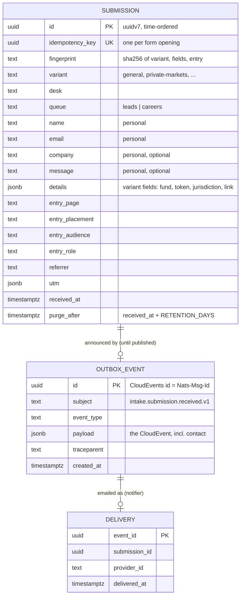

# Data model and data inventory

## Entities

`SUBMISSION` and `OUTBOX_EVENT` are in schema `intake`. `DELIVERY` is in schema
`notifier`, which has no foreign key to `intake`: services share no tables, and the
relationship exists only through the event.

## The event

`ai.eunice.intake.submission.received.v1` is a CloudEvents 1.0 envelope. Its `data`
carries the submission (event-carried state), so the notifier never calls intake back.
The schema is `packages/contracts/src/events/submissions.ts`, and the published document
is `packages/contracts/generated/asyncapi.json`.

## Personal data inventory

| Where | What | Why | Kept for | Deleted by |
|---|---|---|---|---|
| `intake.submissions` | Name, email, company, message, variant fields | To reply to the lead | `RETENTION_DAYS` (365 by default) | Purge timer; erasure endpoint |
| `intake.outbox` | The same, inside the event | To announce the lead reliably | Until published (seconds) | Relay after the broker's ack; erasure |
| NATS `INTAKE` stream | The same, inside the event | To deliver it to the notifier | Until acknowledged; 7 days at most | Work-queue retention; max age |
| Ops / hiring inbox | The email | To reply | The inbox's own policy | Operator (UC-5) |
| `notifier.deliveries` | Event and submission ids only | Send once | 30 days | Purge timer |
| Umami | Page URL, referrer, browser, country; funnel events with the entry point | Measure the site | Umami's retention setting | Umami |
| Logs | Method, route, status, duration, ids; personal fields redacted | Operate | Platform log retention | Platform |
| Traces | Span names, routes, SQL text without parameters | Debug | Collector retention | Collector |
