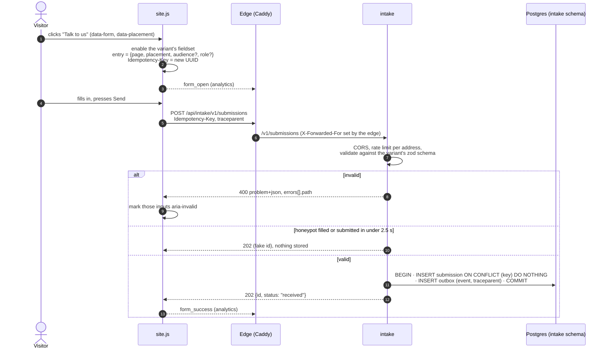
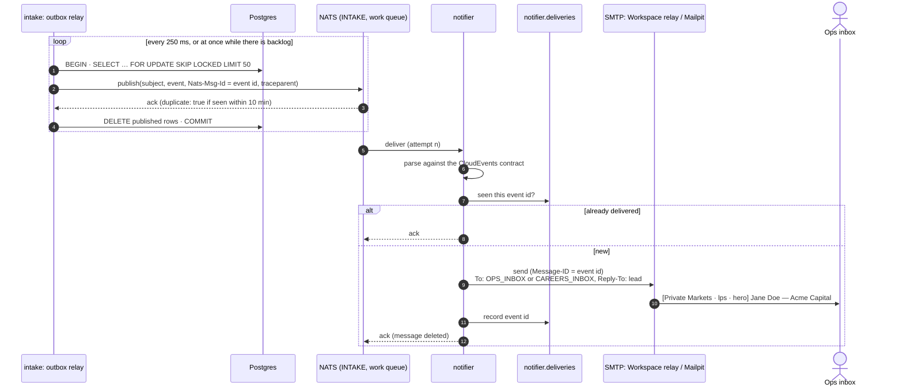
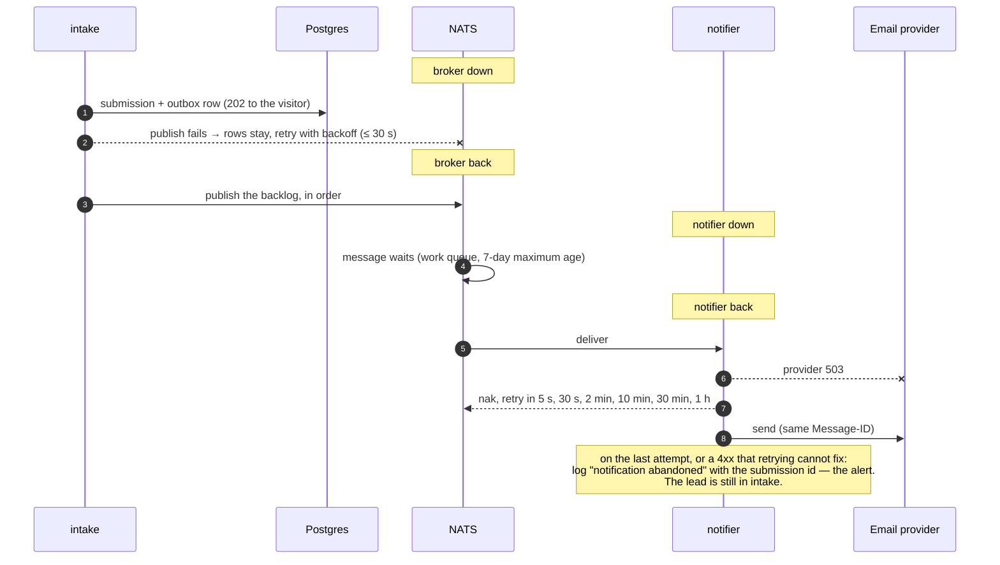
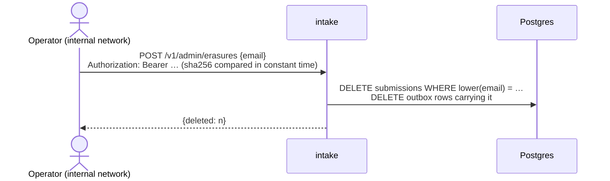
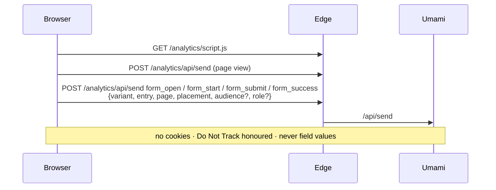

# Flows

How a lead moves through the system, step by step. Each flow names the code that
implements it and the test that proves it.

## 1. Submitting a form

- Code: `apps/web/src/assets/site.js`, `services/intake/src/adapters/http/app.ts`,
  `application/submit.ts`, `adapters/postgres/store.ts`.
- Proven by: `services/intake/test/unit/app.test.ts` (status codes, CORS, 429, 409),
  `test/integration/postgres.test.ts` (atomicity, eight concurrent duplicates → one row),
  `e2e/lead-flow.spec.ts` (three entry points, a server-side rejection, the honeypot).

**A retry is a replay.** The same `Idempotency-Key` with the same content returns the
original id. The same key with different content gets `409`. The fingerprint covers
what was submitted, not the timing signals.

## 2. From the outbox to the ops inbox

- Code: `services/intake/src/adapters/outbox/relay.ts`, `packages/platform/src/nats.ts`,
  `services/notifier/src/application/notify.ts`, `domain/email.ts`.
- Proven by: `services/intake/test/integration/relay.test.ts` (id, trace, de-dup,
  broker restart), `services/notifier/test/unit/*` (once per event, routing, header
  injection), `e2e/lead-flow.spec.ts` (email in Mailpit, one trace across both services).

## 3. When something is down

Proven by `e2e/resilience.spec.ts`. It stops the broker, and then the notifier, while a
lead is submitted, and checks that exactly one email arrives once each is back.

## 4. Erasure (GDPR Art. 17)

The edge does not route `/v1/admin/*`. The notifier holds no personal data. NATS deletes
messages once acknowledged. Mailboxes are outside the system and are cleared by the
operator (runbook, P9).

## 5. Analytics

Proven by `e2e/analytics.spec.ts`: the events arrive in order with the entry point, no
cookie is set, the name and email never reach Umami, and the dashboard is not reachable
through the edge.
