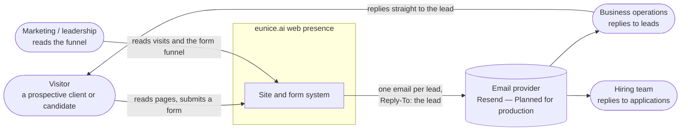
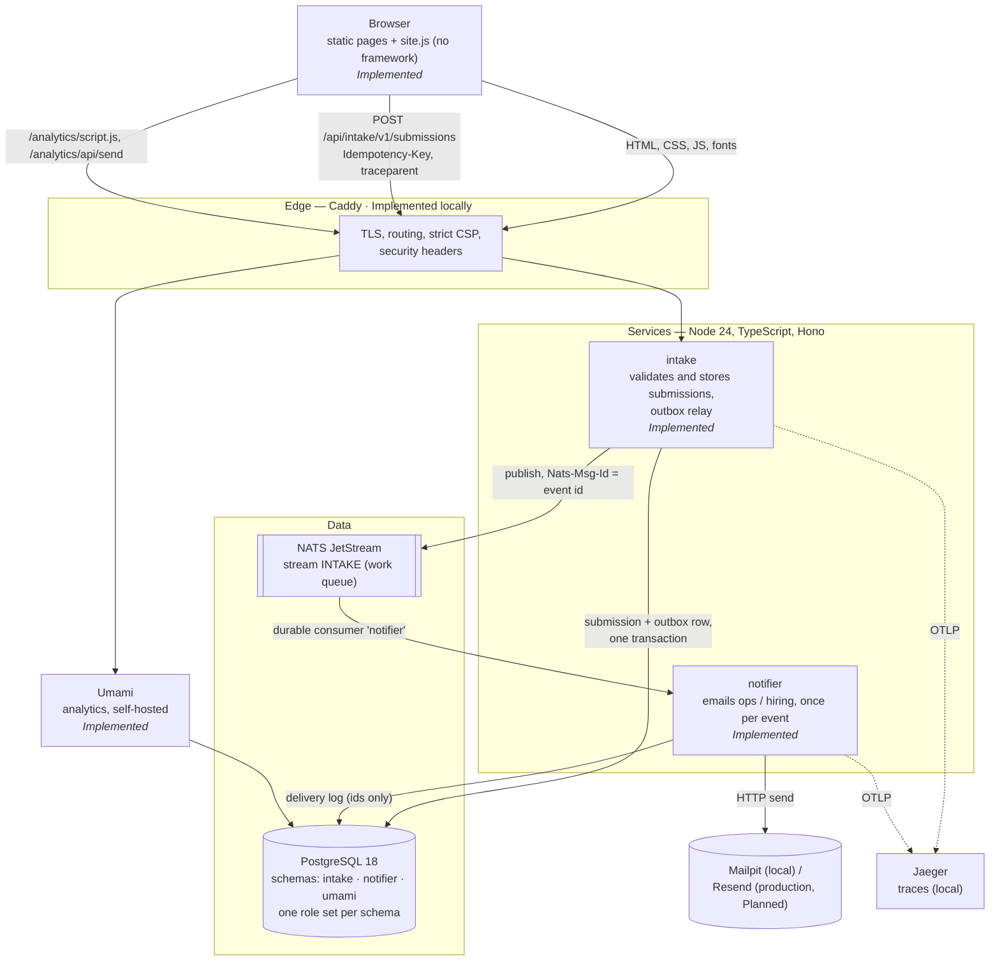
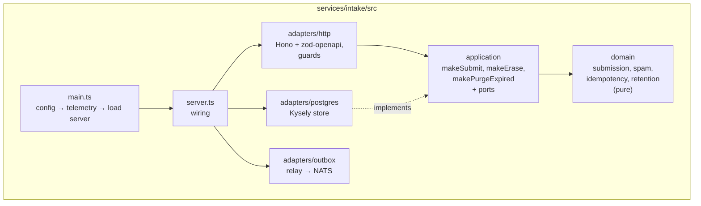
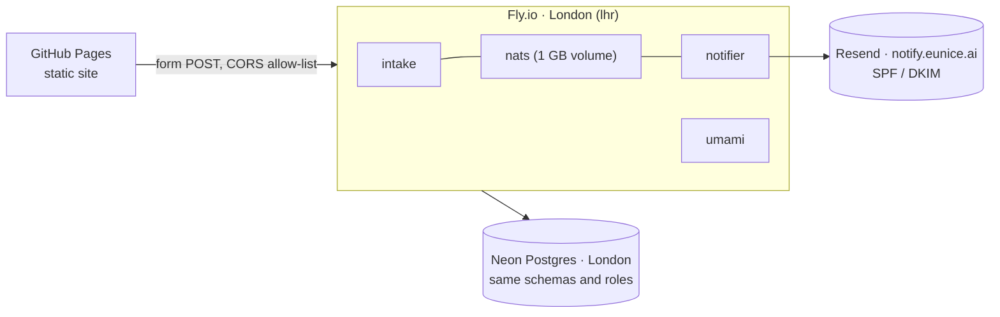

# Architecture overview

The eunice.ai site, and the small system behind its forms. Diagrams follow the
[C4 model](https://c4model.com): context, then containers, then what is inside one.
Every element is marked **Implemented** or **Planned**; the decisions behind each are
in [../adr/](../adr/).

## Level 1 — System context

**Who and what, in one paragraph.** A visitor reads the site and may open a form
from one of many places (the *entry point*). The system stores the submission, then emails
the right inbox so a person can reply within a working day. Analytics shows which pages
and entry points turn into leads. Nothing else is in scope: no accounts, no CMS, no CRM.

## Level 2 — Containers

| Container | Owns | Stores personal data? | Scales by |
|---|---|---|---|
| Static site | Pages, copy, the form registry (at build time) | No | CDN |
| Edge (Caddy) | Routing, TLS, CSP and headers | No (access logs only) | Instances |
| intake | Submissions, their events until published | **Yes** — until `purge_after` | Instances (rate limit is per instance; see ADR-0007) |
| NATS `INTAKE` | Events in flight | **Yes** — until acknowledged, 7 days at most | — |
| notifier | Which events became email | No — event ids and timestamps | Instances (competing consumers) |
| Umami | Visits and funnel events | No — cookieless, no raw IP | — |

**Why these boundaries**: [ADR-0004](../adr/0004-service-boundaries-by-data-classification.md).
They follow what data each part holds and how it fails, not load. What was deliberately
*not* split (content, auth, gateway, orchestration) is listed there too.

## Level 3 — Inside a service

Both services have the same shape, and CI enforces it (`.dependency-cruiser.cjs`):

| Rule (CI) | What it keeps true |
|---|---|
| `domain-imports-only-domain`, `domain-does-no-io` | Business rules are testable with no database, and outlive frameworks |
| `application-does-not-know-adapters` | Use cases depend on ports they own; Postgres and NATS are details |
| `services-are-isolated` | Services meet only through `packages/contracts` (HTTP schemas, events) |
| `contracts-are-a-leaf` | The wire format depends on nothing but zod, so the site can import it |

## Cross-cutting

| Concern | How | Where |
|---|---|---|
| Contracts | zod is the source of truth. OpenAPI 3.1 and AsyncAPI 3.0 are generated from it and drift-checked in CI | `packages/contracts`, `*/generated/` |
| Errors | RFC 9457 problem details, the same shape everywhere | `packages/platform/src/http.ts` |
| Config | Validated at start. A bad value stops the process and names the variable, never the value | `packages/platform/src/config.ts` |
| Logs | JSON on stdout. Personal data is redacted by path, and each line carries the trace id | `packages/platform/src/logger.ts` |
| Traces | W3C context from the browser, through the outbox and the broker, to the email provider | `packages/platform/src/{telemetry,http,nats}.ts` |
| Health | `/healthz` means the process is alive. `/readyz` means each dependency answered in time. intake leaves out the broker on purpose | `packages/platform/src/health.ts` |
| Supply chain | Exact pins, a lockfile, a 3-day release quarantine, install scripts refused by default | [ADR-0002](../adr/0002-dependencies-under-supply-chain-controls.md) |

## Deployment

**Local and CI (implemented)**: `docker compose up --build --wait` starts all the
containers above, plus one-shot migration jobs and the Umami bootstrap. CI runs the same
stack and drives it from a browser.

**Production (planned, gated on the owner; see the plan's go-live gate)**:

All three providers hold SOC 2 Type II reports and keep data in the UK/EU. Deploys run
only from GitHub Actions. Migrations run as a release command before new instances take
traffic, never at boot.
